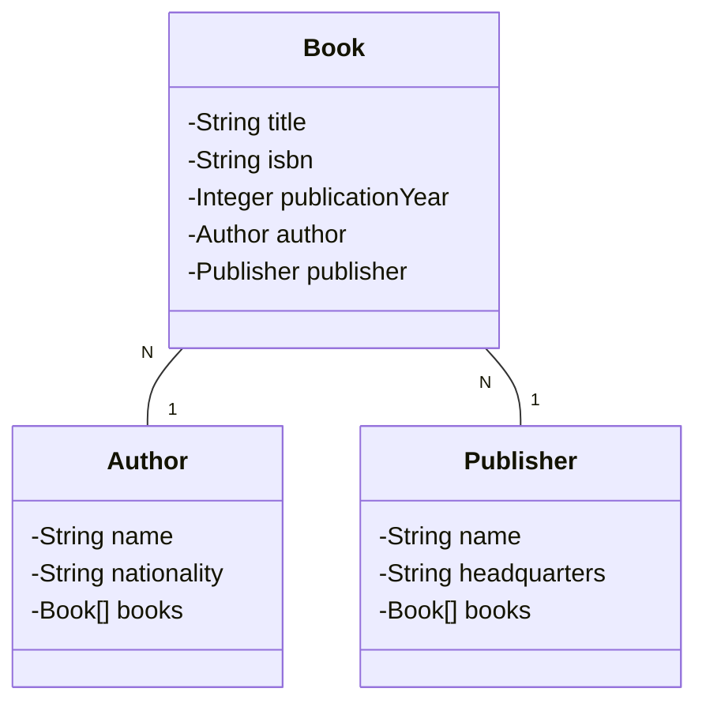

# API REST para Gerenciamento de Biblioteca

Este projeto foi desenvolvido como parte do desafio proposto pela [DIO (Digital Innovation One)](https://www.dio.me/) no programa **Decola Tech**. A API RESTful foi criada para gerenciar uma biblioteca, permitindo operações como criação, leitura e manipulação de livros, autores e editoras.

## Principais Tecnologias

- **Java 17**: Utilizamos a versão LTS mais recente do Java para tirar vantagem das últimas inovações que essa linguagem robusta e amplamente utilizada oferece.
- **Spring Boot 3**: Trabalhamos com a mais nova versão do Spring Boot, que maximiza a produtividade do desenvolvedor por meio de sua poderosa premissa de autoconfiguração.
- **Spring Data JPA**: Exploramos como essa ferramenta pode simplificar nossa camada de acesso aos dados, facilitando a integração com bancos de dados SQL.
- **OpenAPI (Swagger)**: Criamos uma documentação de API eficaz e fácil de entender usando a OpenAPI (Swagger), perfeitamente alinhada com a alta produtividade que o Spring Boot oferece.
- **Railway**: Facilita o deploy e monitoramento de nossas soluções na nuvem, além de oferecer diversos bancos de dados como serviço e pipelines de CI/CD.

## Diagrama de Classes (Domínio da API)

